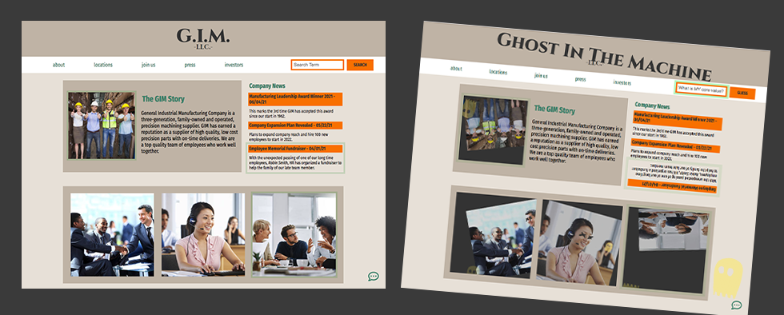

# GIM, LLC

## General Industrial Manufacturing, LLC

_"Commited to providing the best industrial supplies for your company"_

> `enter the ghost in the machine`

_One day, while cleaning the server trays, a kind young soul was thrust into a strange fate.. Their soul now lives within the server and needs your help to be set free..._

GIM LLC is an escape room inspired website where players work together to find clues to free the ghost! 

Server side built using node.js, express, and socket.io for multiplayer interactivity. 

The repository for the front end can be found [here](https://github.com/GIM-LLC/GIM-server).

### Group Members
- Katrina Cloyd [GitHub](https://github.com/KatrinaCloyd) | [LinkedIn](https://www.linkedin.com/in/katrinacloyd/)
- Juli Vela [GitHub](https://github.com/juliannevela) | [LinkedIn](https://www.linkedin.com/in/juliannevela/)
- Casey Warren [GitHub](https://github.com/caseywar) | [LinkedIn](https://www.linkedin.com/in/casey-maynah-warren/)
- Devon Wolfkiel [GitHub](https://github.com/devon-wolf) | [LinkedIn](https://www.linkedin.com/in/devon-wolfkiel/)
- Cameron Zimmerman [GitHub](https://github.com/CameronZimmerman) | [LinkedIn](https://www.linkedin.com/in/cameron-zimmerman/)

## delpoyed site links
GIM, LLC is hosted on [Netlify](https://www.escapegim.com/)

The GIM, LLC server is hosted on [Heroku](https://gim-server.herokuapp.com)

Project planning can be seen on our [Miro board](https://miro.com/app/board/o9J_lA3sn-w=/?utm_source=notification&utm_medium=email&utm_campaign=daily-updates&utm_content=go-to-board).
